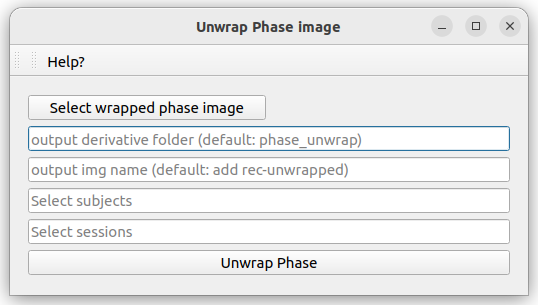

# Phase unwrapping pipeline

This pipeline allows to unwrap and filter phase images obtained from susceptibility-based MRI using a previously proposed docker container (“blakedewey/phase_unwrap - Docker Image | Docker Hub,” n.d.). The analysis of unwrapped phase images (in combination with other MRI contrasts) (Marcille et al., 2022) allows to detect Paramagnetic Rim Lesions (PRL), an emerging neuroimaging prognostic biomarker of chronic active inflammation in MS (Absinta et al., 2021, 2019; Maggi et al., 2020). 

## Utilization

You will find above an image of the window of this pipeline. This window allows the user to enter for which subjects and sessions he wants to unwrap the phase image, and then to launch the pipeline. Here is a list of the features contained in this window:

* "Select subjects" input: allows the user to script the unwrapping of the phase image for other subjects of the dataset by adding a list BIDS ID (without "sub-") separated by a comma. Possible values are: single BIDS ID (e.g. "001,002,006,013"), multiple folowing BIDS ID (e.g. "001-005" is the same as '001,002,003,004,005"), or all subjects ("all").

* "Select sessions" input: allows the user to script the unwrapping of the phase image for other sessions of subjects of the dataset by adding a list session ID (without "ses-") separated by a comma. Possible values are: single session ID (e.g. "01,02,06,13"), multiple folowing session ID (e.g. "01-05" is the same as '01,02,03,04,05"), or all sessions ("all").

* "Phase unwrapping" button: launch the phase_unwrapping script based on all information given by the user.

By default, this pipeline will apply the image processing on the image with the following sequence name: *acq-WRAPPED_part-pahse_T2starw*. If you want to change the name of the sequence on which to run this pipeline, you can change that in the *phase_unwrapping.json* file in the *src* folder (This file is shown below) by changing the value of the *phase* field in the *add_info* dictionary to match the name of your sequence. 

**This pipeline takes about 3 minutes per subject**
